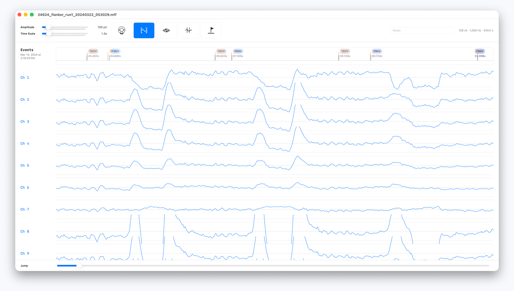
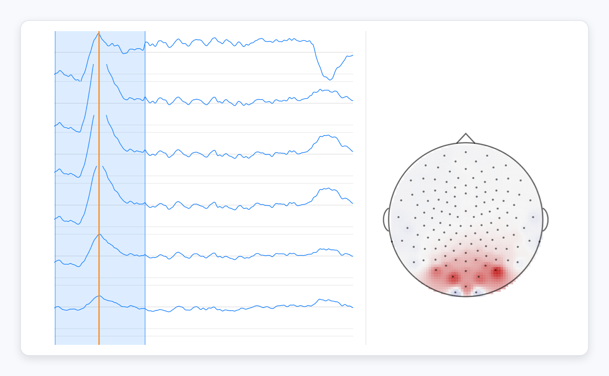
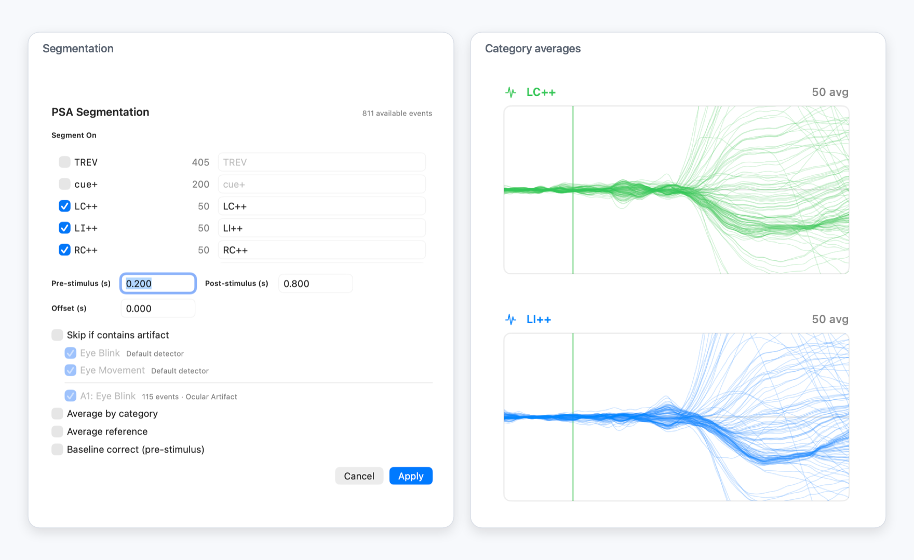
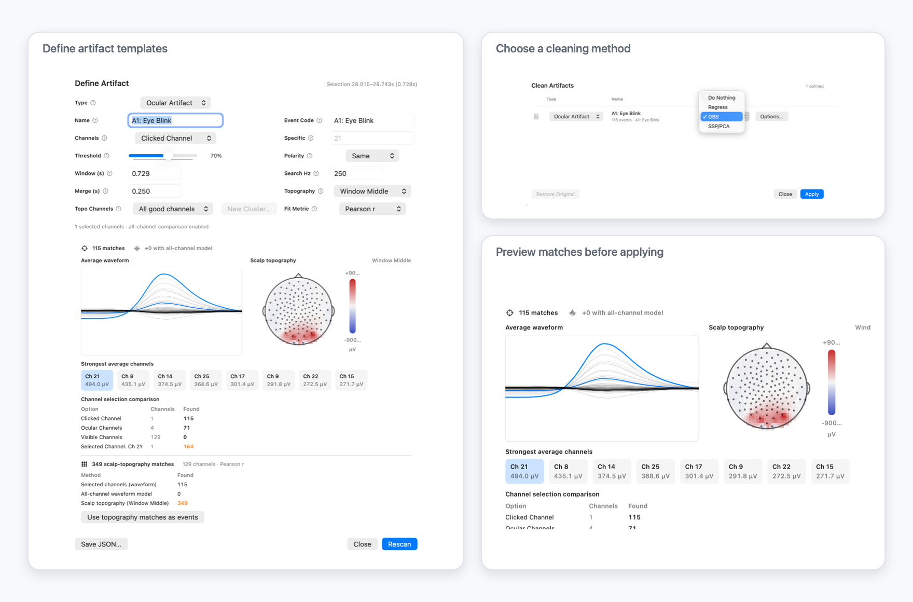
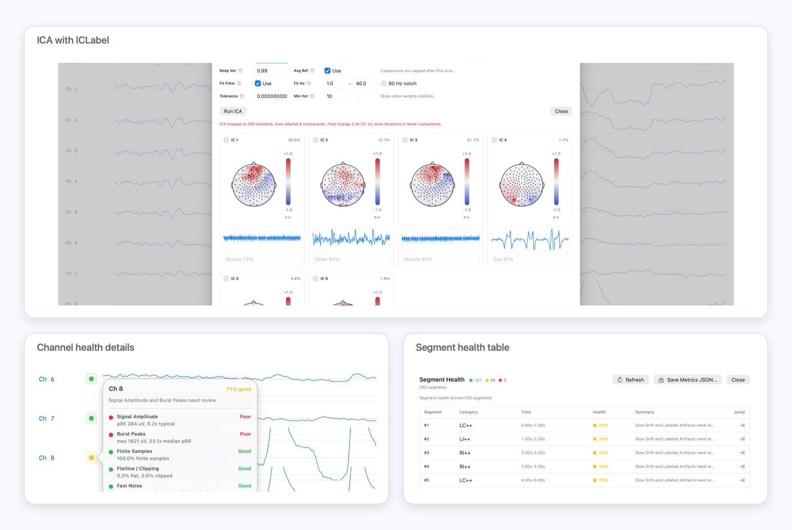

# EVA

**EVA** is a native macOS app for opening, viewing, cleaning, and exploring EEG recordings. It started with EGI MFF data viewer and teaching tool. It has since grown to be a full-fledged analysis tool. 

The goal is (mostly) simple: keep the signal visible, make the processing steps inspectable, and let the boring machinery run in the background while the researcher stays close to the data.

EVA stands for **Electrophysiology Viewer and Analysis**.

<p align="center">
  
</p>

## What EVA Does

EVA opens EGI/MagStim `.mff`.  Thanks to MNE-Python also can read BrainVision, EDF, Persyst, and BESA `.avr` / `.mul` recordings. The main waveform view is intentionally direct: channels on the left, events above the trace, and analysis tools close by without hiding the data.

EVA supports:

- native MFF reading and processed MFF export
- drag-and-drop recording import
- channel hiding, bad-channel marking, and spherical-spline interpolation
- bandpass filtering, notch filtering, and average reference
- simultaneous EEG/fMRI gradient artifact correction
- event browsing and user markers
- topographic maps from sensor layouts
- epoching, category averages, butterfly plots, and overlaid category views
- artifact definition, detection, preview, and cleaning
- ICA with Core ML ICLabel support
- explainable channel and segment health scoring
- JSON export of health metrics for future model training

## Philosophy

EEG review is full of judgment calls. EVA tries to make those calls easier without pretending they disappear. When the app scores a channel, flags a segment, labels an IC, or finds an artifact, it should show its work. The best version of EVA is not an autopilot; it is a good lab companion: fast, transparent, and willing to keep the raw signal in view.

EVA reveres the Open Source projects that it draws inspiration and implementation guidance from. We are fans, contributors, and users of MNE-Python, FieldTrip, and EEGLab. We strongly support these projects and encourage users see EVA as an addition to their lab's toolbox, not a replacement for these critical Open Source neuroimaging/neuroscience works. We will continue to contribute our ideas from EVA back to these open source projects, where critical developments continue to find their best implementations and use-cases. 

EVA is also not _intended_ as a replacement for your vendor's EEG software. We respect many of these commercial projects and would be honored if some of our ideas, implementation, and even code made its way from EVA into packages such as Net Station, BESA, and Analyzer. 


## A Quick Tour

EVA keeps topographies next to the waveform instead of making them a separate mental mode. Double-clicking a sample can bring up a scalp map, which is especially useful when checking whether a burst looks spatially plausible or artifact-like.

<p align="center">
  
</p>

For event-related work, EVA can segment around events and average by category. Baseline correction and average reference can be toggled after segmentation, so you can compare choices without rebuilding the whole view.

Category averages can also be inspected as butterfly plots. Confirm your evoked responses, while checking whether an effect is broadly distributed, channel-specific, or being driven by a few suspicious traces.

<p align="center">
  
</p>

Artifact handling is built around the idea that the user often knows what the artifact looks like before software does. You can highlight a waveform region, define an artifact template, choose the channels and matching behavior, and let EVA scan for similar events.

Once artifacts are defined, EVA can preview and apply cleaning methods. The app currently supports regression, OBS, and SSP/PCA removal

<p align="center">
  
</p>

ICA is available for component-based cleanup. EVA includes a Core ML path for **ICLabel**, using the bundled `ICLabel.mlpackage`, providing useful labels and confidence for data cleaning.

Channel health is an explainable metric, and a training-data path for a future Core ML models. EVA can score channels using finite sample rate, amplitude typicality, burst peaks, flatline/clipping, fast noise, slow drift, line-noise proxy, and neighbor agreement when sensor geometry is present.

Segment health applies the same idea across time. EVA can color segments as good, watch, or poor, then show the underlying reasons in a details panel. Labeled artifact overlap is included as a major signal, and the metrics can be exported as JSON for later model training.

<p align="center">
  
</p>

## Built For macOS

EVA is a SwiftUI app and leans into Apple platform tools.

- **Core ML** runs the bundled ICLabel model for ICA component classification.
- **Accelerate/vDSP** is used throughout signal processing paths where vector math matters.
- **Swift concurrency** keeps loading, filtering, ICA, artifact cleaning, health analysis, and export work off the main UI path.
- **Multicore processing** is used in expensive artifact and MRI-correction paths with `DispatchQueue.concurrentPerform`.
- **SwiftData** stores user markers as sidecar state without modifying source recordings.
- **Native file access** supports drag-and-drop, file importer workflows, and security-scoped resources.

EVA tries to feel like a Mac app: menus for global commands, panels for inspection, sheets for focused actions, and long-running jobs that report progress without freezing the waveform view.

## Supported Inputs

EVA currently opens:

- EGI/MagStim `.mff`
- BrainVision `.vhdr` / `.vmrk` / `.eeg` **
- EDF / EDF+ **
- Persyst `.lay` / `.dat` **
- BESA `.avr` / `.mul` **

** Not fully tested.

Optional electrode location sidecars such as `.sfp`, `.elp`, and `.loc` can be used when a recording format does not already provide sensor geometry.

## Export And Training Data

EVA can export processed recordings back to MFF, including continuous, epoched, or averaged data. It can also save JSON snapshots for the health systems:

- channel labels and channel-health metrics
- segment-health metrics and provenance

Those JSON files are meant to become the raw material for future Core ML models. For now, the health scores are deterministic and explainable; later, a trained tabular model can learn from human-reviewed labels while keeping the same metrics visible in the UI.

## Development Notes

EVA is an Xcode macOS project.

```bash
xcodebuild -project EVA.xcodeproj -scheme EVA -destination platform=macOS build
```

The app is GPL-3.0-only. Some reader behavior and format details were implemented with reference to MNE-Python and related public documentation; see source comments and third-party notices.

The authors of EVA are domain experts in EEG/ERP and other neuroimaging techniques with *decent* programming chops.  However, the codebase stems from years of C, C++, Objective-C tools written by P. Molfese, and as such was translated, improved, and implemented with a combination of human and LLM skills. The code has been used internally for months and iterated on by the authors/developers before we published it to GitHub, so we are reasonably confident in the correctness of the systems. 
