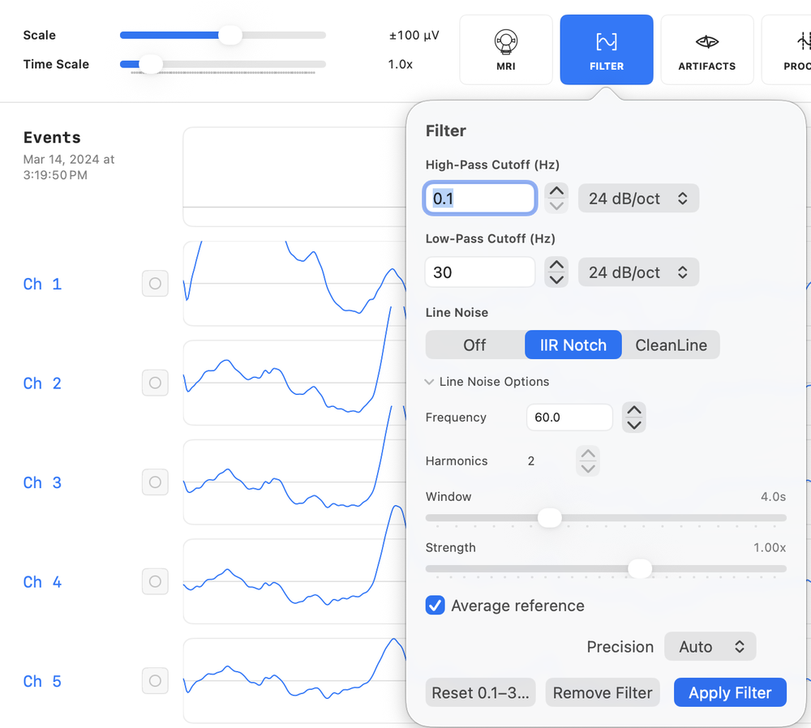
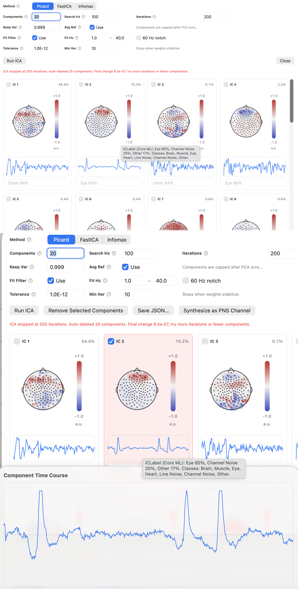

# EVA

**EVA** is a native macOS app for opening, viewing, cleaning, and exploring EEG recordings. It started with EGI MFF data viewer and teaching tool. It has since grown to be a full-fledged analysis tool. 

The goal is (mostly) simple: keep the signal visible, make the processing steps inspectable, and let the boring machinery run in the background while the researcher stays close to the data.

EVA stands for **Electrophysiology Viewer and Analysis**.

<p align="center">
  
</p>

## What EVA Does

EVA opens EGI/MagStim `.mff`.  Thanks to MNE-Python also can read BrainVision, EDF, Persyst, and BESA `.avr` / `.mul` recordings. The main waveform view is intentionally direct: channels on the left, events above the trace, and analysis tools close by without hiding the data.

EVA supports:

- native MFF reading and processed MFF export
- drag-and-drop recording import
- channel hiding, bad-channel marking, and spherical-spline interpolation
- bandpass filtering, notch filtering, and average reference
- simultaneous EEG/fMRI gradient artifact correction
- event browsing and user markers
- topographic maps from sensor layouts
- epoching, category averages, butterfly plots, and overlaid category views
- artifact definition, detection, preview, and cleaning
- ICA with Core ML ICLabel support
- explainable channel and segment health scoring
- JSON export of health metrics for future model training

## Philosophy

EEG review is full of judgment calls. EVA tries to make those calls easier without pretending they disappear. When the app scores a channel, flags a segment, labels an IC, or finds an artifact, it should show its work. The best version of EVA is not an autopilot; it is a good lab companion: fast, transparent, and willing to keep the raw signal in view.

EVA reveres the Open Source projects that it draws inspiration and implementation guidance from. We are fans, contributors, and users of MNE-Python, FieldTrip, and EEGLab. We strongly support these projects and encourage users see EVA as an addition to their lab's toolbox, not a replacement for these critical Open Source neuroimaging/neuroscience works. We will continue to contribute our ideas from EVA back to these open source projects, where critical developments continue to find their best implementations and use-cases. 

EVA is also not _intended_ as a replacement for your vendor's EEG software. We respect many of these commercial projects and would be honored if some of our ideas, implementation, and even code made its way from EVA into packages such as Net Station, BESA, and Analyzer. 


## A Quick Tour

The main waveform view keeps channels, events, and the tools you'll actually reach for (MRI, filter, artifacts, process, EEG, events) in one place, with a running log of what's been applied to the recording so far.

<p align="center">
  
</p>

Filtering, notching, and average referencing live in a single popover reachable from the toolbar, so adjusting a Butterworth cutoff or line-noise correction doesn't pull you out of the waveform.

<p align="center">
  
</p>

Channel health and segment health share the same explainable scoring idea — a good/watch/poor score broken down into the specific metrics (signal amplitude, spectral outliers, burst peaks, line harmonics, impedance, slow drift, labeled-artifact overlap, and more) that drove it, so a score is never a black box.

<p align="center">
  
</p>

ICA is available for component-based cleanup, with a Core ML path for **ICLabel** (using the bundled `ICLabel.mlpackage`) providing per-component labels and confidence. Selecting a component drops its full time course into view right below the grid, so you can verify a labeled component against its own waveform before removing it or exporting it as a synthetic PNS channel.

<p align="center">
  
</p>

EVA keeps topographies next to the waveform instead of making them a separate mental mode — double-clicking a sample can bring up a scalp map, useful for checking whether a burst looks spatially plausible or artifact-like. Category averages give you the same data from a different angle, as butterfly plots that make it easy to see whether an effect is broadly distributed, channel-specific, or being driven by a few suspicious traces.

<p align="center">
  
</p>

Artifact handling is built around the idea that the user often knows what the artifact looks like before software does. You can highlight a waveform region, define an artifact template from its waveform or scalp topography, choose the channels and matching behavior, and let EVA scan the recording for similar events. Once artifacts are defined, EVA can preview and apply cleaning methods — the app currently supports regression, OBS, SSP/PCA, and several averaging-based approaches.

<p align="center">
  
</p>

For event-related work, EVA can segment around events and average by category, with baseline correction and average reference toggled after the fact so you can compare choices without rebuilding the whole view.

<p align="center">
  
</p>

Once averages are computed, EVA lets you inspect them as waveforms, topomaps, or butterfly plots with a channel inspector and a movable latency cursor. The same segmented data feeds single-trial analysis: pick a channel and an analysis window, and EVA extracts per-trial peak and amplitude values you can export as a trial matrix for further stats.

<p align="center">
  
</p>

## Built For macOS

EVA is a SwiftUI app and leans into Apple platform tools.

- **Core ML** runs the bundled ICLabel model for ICA component classification.
- **Accelerate/vDSP** is used throughout signal processing paths where vector math matters.
- **Swift concurrency** keeps loading, filtering, ICA, artifact cleaning, health analysis, and export work off the main UI path.
- **Multicore processing** is used in expensive artifact and MRI-correction paths with `DispatchQueue.concurrentPerform`.
- **SwiftData** stores user markers as sidecar state without modifying source recordings.
- **Native file access** supports drag-and-drop, file importer workflows, and security-scoped resources.

EVA tries to feel like a Mac app: menus for global commands, panels for inspection, sheets for focused actions, and long-running jobs that report progress without freezing the waveform view.

## Supported Inputs

EVA currently opens:

- EGI/MagStim `.mff`
- BrainVision `.vhdr` / `.vmrk` / `.eeg` **
- EDF / EDF+ **
- Persyst `.lay` / `.dat` **
- BESA `.avr` / `.mul` **

** Not fully tested.

Optional electrode location sidecars such as `.sfp`, `.elp`, and `.loc` can be used when a recording format does not already provide sensor geometry.

## Export And Training Data

EVA can export processed recordings back to MFF, including continuous, epoched, or averaged data. It can also save JSON snapshots for the health systems:

- channel labels and channel-health metrics
- segment-health metrics and provenance

Those JSON files are meant to become the raw material for future Core ML models. For now, the health scores are deterministic and explainable; later, a trained tabular model can learn from human-reviewed labels while keeping the same metrics visible in the UI.

## Development Notes

EVA is an Xcode macOS project.

```bash
xcodebuild -project EVA.xcodeproj -scheme EVA -destination platform=macOS build
```

The app is GPL-3.0-only. Some reader behavior and format details were implemented with reference to MNE-Python and related public documentation; see source comments and third-party notices.

The authors of EVA are domain experts in EEG/ERP and other neuroimaging techniques with *decent* programming chops.  However, the codebase stems from years of C, C++, Objective-C tools written by P. Molfese, and as such was translated, improved, and implemented with a combination of human and LLM skills. The code has been used internally for months and iterated on by the authors/developers before we published it to GitHub, so we are reasonably confident in the correctness of the systems. 
