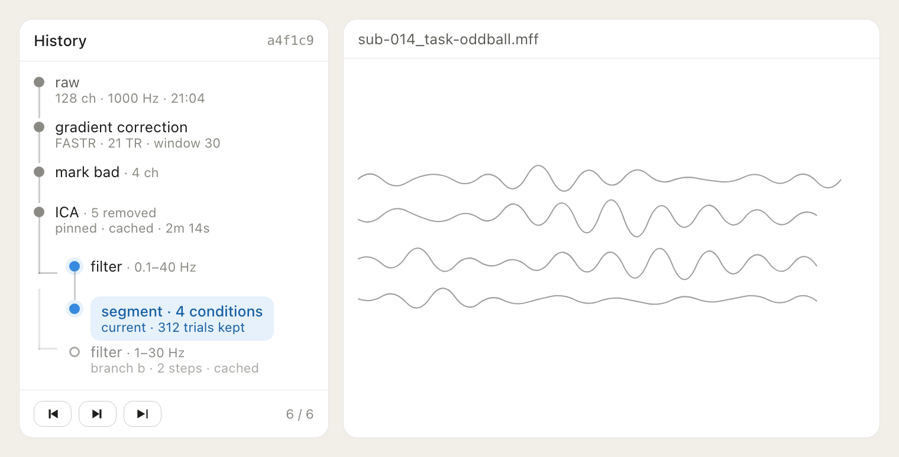
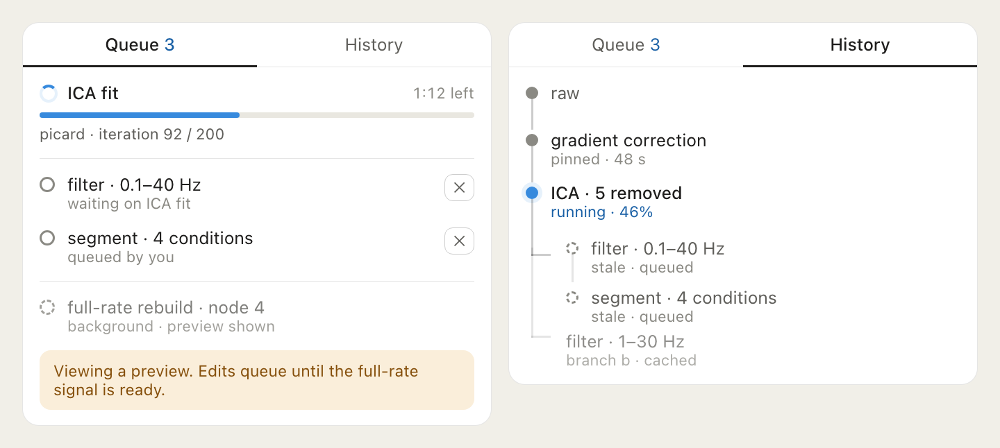

# EVA — REWIND

Design for a **history tree**: git-style navigation over a recording's processing
history, with real undo/redo, branching, and step-by-step scrubbing.

Written 2026-08-11. Nothing here is implemented yet.

---

## The problem today

Undo exists per-stage, but there is no history and no redo.

Each stage owns a `clear*()` that nils its cached output and then **hand-cascades
into every downstream stage**. `clearGradientCorrection()`
(`EVA/Gradient/MRIGradientArtifactViews.swift:1034`) is the clearest example — it
manually nils `ica.cleanedSignal`, `ica.decomposition`, `filter.output`,
`filter.pnsOutput`, `filter.pnsInputSignalType`, calls
`clearAppliedArtifactCleaning()`, bumps `artifactVM.detectionRefreshToken`, then
invalidates epochs and interpolations.

Three consequences:

1. **The cascade is hand-written per stage**, so every new stage means editing
   every earlier stage's clear function. It is a correctness hazard by
   construction — a missed line leaves a stale downstream signal that silently
   contradicts the chain.
2. **Undo is destructive.** The cleared work is gone; there is no redo, and no way
   to compare "with ICA" against "without ICA" other than redoing it by hand.
3. **The chain order is knowledge held in three places** — `body`,
   `currentMFFExportSnapshot()`, and `currentProcessingScript()`
   (`EVA/IO/MFFExportFlowViews.swift`) — with a comment asking future editors to
   keep them in sync.

A history model fixes all three, because the cascade becomes *derived* rather
than written.

---

## What it looks like



The sidebar sits left of the waveform. A linear trunk from `raw`, a fork after
ICA (0.1–40 Hz applied, a dimmed 1–30 Hz branch below), the current node
highlighted, and transport controls at the bottom. Node subtitles carry the
parameters that define them plus cache state.

Figures are generated from the HTML sources beside them:

```bash
cd docs/figures && for n in 1 2; do "/Applications/Google Chrome.app/Contents/MacOS/Google Chrome" --headless --force-device-scale-factor=2 --hide-scrollbars --screenshot="REWIND_FIG_$n.png" --window-size=760,700 "file://$PWD/REWIND_FIG_$n.html"; magick "REWIND_FIG_$n.png" -trim +repage -bordercolor '#f1efe8' -border 32 "REWIND_FIG_$n.png"; done
```

---

## Core model

**The step list is the truth. The signal is a cache.**

A node is not "a saved copy of the data". A node is the ordered list of steps
that produced it, plus whatever subject-specific payload is needed to re-apply
those steps exactly. The signal at that node is derived, cacheable, and
evictable.

This is the whole design. Everything below follows from it.

```
Node
  id            stable hash of (parentID, operation, sorted params, payload digest)
  parent        Node?  — nil for `raw`
  step          EVAProcessingStep     (already exists, already Codable)
  payload       subject-specific data needed for exact re-application
  cache         MFFSignalData?        (evictable; never the source of truth)
  preview       decimated signal for display — cheap, cached far more freely
  computeCost   measured wall time of the first computation; drives eviction
  label         user-editable, defaults to a rendering of the step
```

Navigating to a node means: find the nearest cached ancestor, then re-apply the
steps between it and the target. Undo is "navigate to parent". Redo is "navigate
to the child you came from". Branching is free — it's just a second child.

### Why the payload matters

Recomputation only works if steps are **deterministic**. Several are not, and
this is the single most important design constraint:

| Operation | Deterministic? | Payload needed |
|---|---|---|
| `filter` | yes | none |
| `waveletReduce` | yes | none |
| `thresholdArtifactDetection` | yes | none |
| `segment` / `baseline` / `average` | yes | none |
| `mriGradientCorrection` | yes, given same params | none |
| `interpolateChannels` | yes, given the channel list | channel indices |
| `markBad` | n/a — it *is* a decision | channel indices |
| `icaClean` | **no** — stochastic fit | `unmixingMatrix` + `channelMeans` + excluded indices |
| `artifactClean` | **no** — user-drawn templates | template/event definitions |
| `bcgDetection` | subject-specific | detection parameters + marks |

For ICA the fix is neat: store the unmixing matrix (~70 KB at 128 ch) and the
excluded set, and "re-applying ICA" becomes a matrix multiply rather than a
refit — faster *and* exactly reproducible. Refitting would silently produce a
different decomposition and break the guarantee that navigating back to a node
returns you to the same data.

Every payload is small. Nothing here approaches the size of a signal.

**This overlaps `REPORTS.md` work item 1** — persisting ICA state is a
prerequisite for both the report and the history tree. Do it once, serve both.

---

## Navigation semantics: replay, recompute, fork

Three user intents, but **fork is the only primitive**. Because a node ID hashes
`(parent, operation, params, payload)`, changing a step's parameters *always*
produces a new node — the old one still exists and its cache is still valid. The
only difference between the three is what happens to the old subtree.

| Intent | Mechanism | Old subtree | Cost |
|---|---|---|---|
| **Replay** — click back, click forward | navigate; node ID unchanged so the cache is still valid | untouched | free if cached |
| **Recompute** — "change it and move on" | fork, then prune the orphaned branch | discarded | re-derive descendants |
| **Fork** — "try it the other way" | fork, stay branched | kept and cached | re-derive new branch only |

Consequences worth designing around:

- Build fork; recompute is fork plus a cleanup pass. The **destructive path is the
  derived one**, so the non-destructive behavior is the default — which is what
  you want while someone is exploring.
- **Prune lazily.** Keep the orphaned subtree until memory pressure or session
  close. "Change it and move on" stays silently undoable for a while at no
  design cost.
- Replay must never recompute when a valid cache exists. Node identity is what
  guarantees this: if the ID matches, the bytes match.
- The A/B case ("with and without ICA") is just two sibling nodes with the user
  alternating between them. See ping-pong pinning below.

---

## Memory: the real constraint

A cached signal is large. 128 ch × 1000 Hz × 20 min × 4 bytes ≈ **614 MB**.
256 ch × 60 min ≈ **3.7 GB**. Caching every node is not an option.

Policy:

- **Always cache**: `raw` (or memory-map it from the package) and the current node.
- **Pin manually**: user can pin a node; pinned nodes stay resident. Pin the
  expensive ones — post-gradient, post-ICA.
- **Evict LRU**, spilling to the scratch directory rather than dropping outright
  when disk is cheaper than recompute.
- **Auto-pin expensive stages** by measured wall time: if a step took >30 s, keep
  its output by default.
- **Show the cost.** Each node in the sidebar knows whether navigating to it is
  instant (cached), fast (a few cheap steps), or slow (needs a gradient re-run).
  Surface that before the click, not after.

Recompute cost is bounded because the chain is short — at most ~8 stages — and
the expensive ones are exactly the ones worth pinning.

### Making it feel seamless

Three levers, in rough order of payoff.

**1. Cache at display resolution, not full rate.** `WaveformView` draws decimated
data anyway. A 10× decimated cache is ~60 MB instead of ~614 MB, so a dozen nodes
fit in the memory of one. Navigation repaints instantly from the decimated cache
while the full-rate signal recomputes in the background — needed only when the
user *acts* on the data (export, next processing step, ICA fit), not when they
merely look at it. `Downsampler` already exists. This is probably the single
biggest lever on perceived responsiveness.

**2. Measure, never guess.** Store measured wall time on every node the first
time it is computed. The policy is then self-tuning — no hardcoded "gradient is
expensive" table that is wrong on a different machine or a longer recording.
Eviction becomes a standard cost-per-byte decision: evict the lowest
`recomputeCost / bytes` first, which keeps FASTR and ICA outputs resident while a
filter output (cheap to redo, same size) is dropped freely.

Rough thresholds, subject to the measured numbers:

| Estimated recompute | Policy |
|---|---|
| < ~100 ms | never cache — it is free |
| ~100 ms – ~2 s | let cost-per-byte decide |
| > ~2 s | always try to cache; auto-pin |

**3. Speculate on neighbors.** Sitting at node N, background-compute its
children so click-forward is instant. And detect **ping-ponging** specifically:
a user alternating between two siblings is the A/B comparison use case, and both
nodes should be auto-pinned once it is clear that is what is happening (three
alternations is a reasonable trigger). Cancel speculation when the user moves
elsewhere — `ProcessingQueue` and the existing cancellation checks
(`try Task.checkCancellation()`) already support this.

---

## Granularity

Open question, and the one most likely to be got wrong.

**Proposal: a node is a step that changes the derived signal, or changes what
gets exported.** That means `apply filter`, `remove ICA components`, `mark bad`,
`interpolate`, `segment`, `turn artifact correction off` all get nodes. Panning
the waveform, changing a display scale, or opening a sheet do not.

Two things deserve care:

- **Toggles.** "Turn artifact correction off" is a real node (it changes the
  data), but a user flipping it back and forth six times should not produce six
  nodes. Collapse a toggle back to its previous state — navigating to an existing
  identical node rather than creating a new one. The node ID being a hash of the
  full ancestry makes this automatic: the same steps in the same order produce
  the same ID, so the tree self-deduplicates.
- **Parameter tweaking.** Adjusting a filter cutoff four times while previewing
  should produce one node, not four. Debounce: only commit a node when the stage
  is *applied*, not while its sheet is open. EVA already distinguishes preview
  from apply in the wavelet and artifact flows.

---

## The queue and the tree are one state machine

The sidebar is a tab view — **Queue** and **History** — but they are two
renderings of the same objects, not two systems. A queued operation *is* a node
that does not have its signal yet.



Every node has a lifecycle:

```
stale → queued → running → cached (preview) → cached (full-rate)
```

History renders that lifecycle **positionally** (where in the tree). Queue
renders it **temporally** (what order, how long, what is blocking). The count
badge on the Queue tab is the number of nodes in `queued` or `running`.

### Work classes and priority

Pending work must say *why* it is waiting, because that determines cancel
semantics:

| Class | Shown as | Cancelling it |
|---|---|---|
| User-initiated | "queued by you" | also cancels everything downstream |
| Dependency of user work | "waiting on ICA fit" | cancels the parent request |
| Speculative (neighbor precompute, full-rate rebuild) | de-emphasized, "background" | free and silent |

Priority order: user-initiated > dependency-of-user > speculative. **Speculative
work is always preemptible** — it must yield the moment real work arrives.
`ProcessingQueue` and the existing `try Task.checkCancellation()` checks give us
most of this.

### Stale descendants stay visible

When an ancestor changes, its descendants do not disappear from the tree. They
render dashed and greyed as `stale · queued`. This is what makes "you changed
step 2, so steps 3 and 4 will be different" legible rather than surprising, and
it gives the user something to click to prioritise.

### Resolving the preview race

The two-tier cache creates a window where the display shows node N but the
full-rate signal is not ready. Rather than blocking:

- Say so plainly in the sidebar — "viewing a preview; edits will queue".
- Scrolling, zooming, and inspection work immediately off the preview.
- Any action needing real samples (apply a stage, fit ICA, export) is **enqueued**
  against the full-rate rebuild rather than reading a partial buffer.

Reading a not-yet-valid buffer is the same class of bug as the current
hand-written cascades. Making the queue the only path to the full-rate signal is
what prevents reintroducing it.

### It replaces the scattered progress UI

Progress is currently per-view-model — `operationProgress: OperationProgress?` on
`GradientViewModel`, `FilterViewModel`, and others, each fed by its own
`ProgressBridge.make { … }` and surfaced in its own panel. The Queue tab becomes
the **single consumer**: one place that shows what is running regardless of which
stage owns it. Per-VM progress state migrates to the queue rather than each sheet
rendering its own bar.

This is a simplification, not an addition — and it is a natural companion to the
Priority 1 Observation work, since it removes a set of frequently-ticking
`@Published` properties from view models whose bodies are expensive to
re-evaluate.

---

## Interactions

The sidebar is the primary view for navigating processing state, not a passive
readout.

**Click a node** — navigate to it. Instant when cached, otherwise it enqueues the
recompute and shows the estimated cost first. This is undo and redo: clicking
the parent is undo, clicking back down is redo. No separate undo stack.

**Right-click a node** — context menu:

| Item | Behavior |
|---|---|
| Branch from here | fork: creates a sibling and makes it current |
| Pin / unpin | force the signal resident, exempt from eviction |
| Rename… | user label, replacing the default step rendering |
| Compare with current | A/B against the current node (see below) |
| Export from here… | export the package at this node, not at the tip |
| Report from here… | generate an `EVAReport` for this node (see `REPORTS.md`) |
| Delete branch | prune this node and its descendants; disabled on ancestors of current |

**Hover a node** — show the cost hint (cached / fast / needs a gradient re-run)
and the measured `computeCost` from when it was first computed.

**Double-click a step's parameters** — reopen that stage's sheet with its recorded
parameters loaded. Applying with changes forks; applying unchanged is a no-op
because the node hash is unchanged.

**Transport controls** — step back, step forward, replay to tip. Forward along
the branch last visited, so back-then-forward is always a round trip.

**Keyboard** — `⌘Z` / `⇧⌘Z` map to step back and step forward, so the feature is
reachable without the sidebar open and behaves the way every other Mac app does.

### A/B compare

The payoff of the whole design, and worth building explicitly rather than leaving
users to click back and forth. Selecting two nodes offers:

- overlay both signals in `WaveformView` in contrasting colors
- difference trace (A − B)
- side-by-side SNR / channel-health metrics for the two nodes
- for epoched nodes, butterfly plots side by side

"What did ICA actually buy me?" becomes a two-click question. This also feeds
`REPORTS.md`: a comparison report between two branches of one recording is a
genuinely novel artifact to offer.

---

## Machinery that already exists

Most of this is built.

| Need | Existing |
|---|---|
| Node payload type | `EVAProcessingStep` / `EVAProcessingScript` — already `Codable`, already serialized as `eva.xml` |
| Canonical chain order | `currentProcessingScript()`, `currentMFFExportSnapshot()` |
| Applying a step list without UI | `HeadlessBatchProcessor`, `ProcessingCore` |
| Walking a script with pauses | `ReplayController` — this *is* fast-forward, with `.auto` / `.review` / `.decision` gates already classified by `ReplayInteraction` |
| Which steps need human input | `EVAProcessingStep.replayInteraction` |
| Per-stage teardown primitives | the existing `clear*()` / `resetForClose()` functions |
| Provenance rendering | `EVAProcessLog` |

`ReplayController` is the standout. It already walks an ordered script, applies
each step, and gates on the ones needing a decision. Fast-forward is that,
pointed at a node's ancestry instead of an imported script.

---

## What has to be built

1. **`EVAHistory`** — the tree: nodes, current pointer, insert/navigate/branch/
   delete-branch, node ID hashing.
2. **Signal cache** — two tiers (decimated preview, full-rate), pinning,
   cost-per-byte eviction, scratch-disk spill, measured `computeCost` per node,
   neighbor speculation, and ping-pong detection.
3. **Generic invalidation** — replace the hand-written cascades. Once the tree
   knows the chain order, "everything after node N is invalid" is derived, and
   `clearGradientCorrection()` and its siblings collapse into
   `history.navigate(to: node.parent)`.
4. **Payload persistence** — ICA unmixing + excluded set, artifact templates, bad
   channel lists. Shared with `REPORTS.md` item 1.
5. **Determinism audit** — verify each operation in the table above actually
   reproduces bit-for-bit given identical inputs. Anything that doesn't must
   either become payload-backed or be marked cache-only (never evicted, because
   it cannot be regenerated).
6. **Session persistence** — write the tree into the package as `eva_history.json`
   so reopening a file restores its history. `eva.xml` remains the *current*
   linear chain, i.e. the path from root to the current node; the history file is
   the full tree. This keeps `eva.xml` backward compatible.
7. **Queue integration** — node lifecycle states, the three work classes with
   preemptible speculation, and enqueueing user actions against a pending
   full-rate rebuild instead of reading a partial buffer.
8. **UI** — the left sidebar: Queue / History tab view, tree rail, current-node
   highlight, stale-descendant rendering, transport controls, per-node cost hint,
   pin toggle, branch labels, and the right-click menu.
9. **Progress consolidation** — migrate per-VM `operationProgress` into the queue
   so there is one progress surface instead of one per stage.
10. **A/B compare** — overlay, difference trace, and side-by-side metrics for two
    selected nodes.

---

## Interactions with existing features

**Copy processing from…** becomes "graft this script as a branch from the current
node". Same engine.

**Batch processing** gains a natural definition of "process these 40 files to the
same node" — the chain hash from `REPORTS.md` §3 identifies the target state.

**Reports** get better: a report can name the exact node it describes, and a
comparison report between two branches of the same recording becomes possible —
which is a genuinely novel thing to offer ("what did ICA actually buy me?").

**Multi-recording combine** needs thought: combining N recordings means N history
trees converging on one node. Probably the combined output starts a fresh tree
that records its inputs' node IDs as provenance, rather than trying to merge
trees. Deferred.

---

## Open questions

- **Does the branch tree earn its complexity, or is linear undo/redo enough?**
  Branching is the expensive part of both the model and the UI. Worth prototyping
  linear-only first and seeing whether the fork is missed. The node model above
  supports branching without requiring the UI to expose it on day one.
- **What happens to a branch when the user edits an ancestor's parameters?**
  Git's answer is rebase. Ours might be "invalidate descendants and offer to
  re-apply", which is a cheaper promise.
- **Should nodes survive export?** A package written from node N — does it carry
  the whole tree or just its own lineage? Leaning toward whole tree, since it is
  small (steps + payloads, no signals) and makes a package self-documenting.
- **Interaction with the Priority 1 Observation refactor** (`ROADMAP.md`). The
  history tree changes how VM state is owned — arguably it *is* a state-ownership
  refactor. Sequencing matters: doing this before the Observation work may mean
  doing it twice; doing it after may make the Observation work easier to reason
  about. Probably: after.
