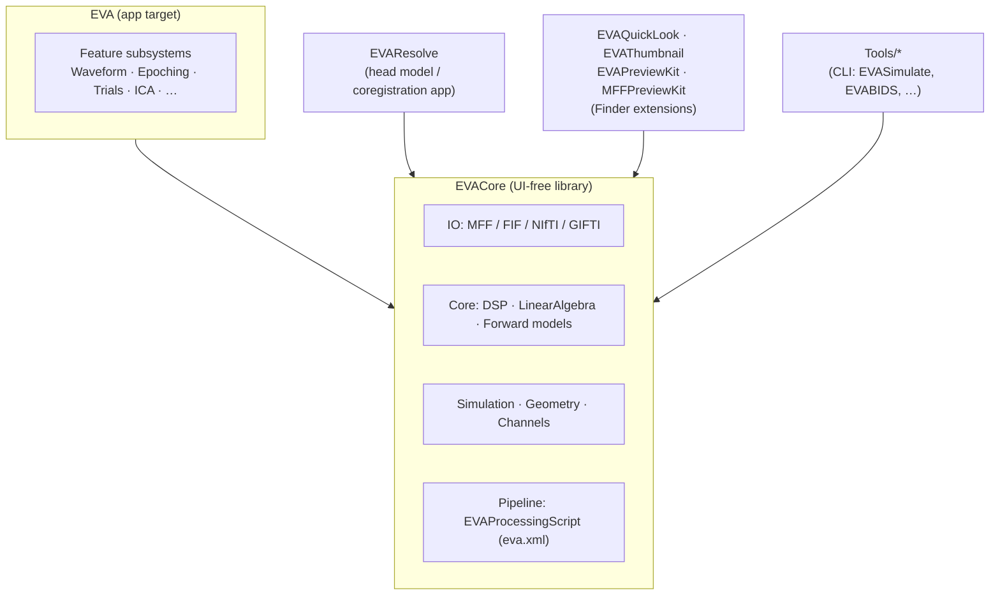

# EVA Architecture Map

> **Audience:** maintainers who need to find *where* a feature lives and *how* to
> change it — not end users. This page is the entry point to `docs/developers/`.
> It is deliberately distinct from `docs/manual/` (user-facing) and
> `docs/provenance/` (method specifications).
>
> **Status:** DEV-1a (architecture map). The per-subsystem deep dives (DEV-1b)
> and the feature→code index (DEV-1c) are separate pages; see
> [What's next](#whats-next).

## How to read this page

The map is organized to mirror how a recording actually moves through EVA:
**load it → clean it → cut it into epochs → analyze the epochs → look at the
result**, with a few *spines* running underneath the whole thing (history/undo,
provenance, channel geometry, the forward model).

Each subsystem gets one paragraph: its **purpose**, the **entry-point types** a
newcomer starts from, and the **key functions** where the real work happens — so
you can jump from "I need to change BCG detection" to the exact
`RWaveDetector.detect(...)` call without reading the tree first. Types are named
as they appear in source; files are given relative to their module directory.

A note on modules before the subsystems: EVA is **not** one target.

---

## Module topology

EVA is a macOS SwiftUI app plus a UI-free computational core and a handful of
satellite targets. Knowing which target a file lives in tells you what it may
depend on.



| Target | Role | Depends on |
|---|---|---|
| **`EVA/`** | The macOS app: every feature subsystem, view model, and SwiftUI view. | `EVACore` |
| **`EVACore/`** | Pure computation + file I/O + data types. **No UI.** This is the reusable heart — MFF/FIF/NIfTI/GIFTI readers, DSP, the forward model, the simulator, and the `eva.xml` schema all live here. | Accelerate / Metal only |
| **`EVAResolve/`** | A separate window/app for head-model work: MRI slice viewing, coregistration, BEM import. See `EVAResolve/HeadModel/`. | `EVACore` |
| **`EVAQuickLook` / `EVAThumbnail` / `EVAPreviewKit` / `MFFPreviewKit`** | Finder QuickLook previews and thumbnails for `.mff`, `.fif`, and `.gii` files. | `EVACore` |
| **`Tools/`** | Command-line helpers: `EVASimulate` (headless scalp-EEG generator), `EVABIDS`, `forward-compare`, `resolve-validate`, `RhythmicityReference` (Python oracle), `fif-import`, `mffTimingTool`, `EVAHelper`. | `EVACore` |

**Rule of thumb:** anything that must be testable in isolation, run headless in a
CLI, or reused by QuickLook belongs in `EVACore`. Anything that touches SwiftUI,
menus, or the recording window belongs in `EVA/`.

---

## The central data model

Five types carry state through the entire app. Learn these first.

- **`MFFSignalData`** — `EVACore/IO/MFFReader.swift`. The in-memory
  multichannel signal: sample buffers, sample rate, channel metadata, events. It
  is the currency every cleaning stage consumes and produces. `MFFReader` parses
  the `.mff` package into an `MFFPackage` / `MFFSignalData` / `[MFFEvent]`;
  `MFFWriter` (`EVACore/IO/MFFWriter.swift`) serializes it back out.
- **`MFFRecording`** — `EVA/IO/MFFRecording.swift`. The app-level document that
  *wraps* a recording: channel roles, edits, and the association to a history
  tree. This is the object a recording window is built around.
- **`ChannelModel`** — `EVA/Channels/ChannelModel.swift`. The per-recording
  observable UI model. Besides channel/interpolation state it defines the many
  SwiftUI **environment "command keys"** (`MFFExportRequestKey`,
  `PSAViewControlsKey`, `ArtifactMenuControlsKey`, …) that wire menu bar commands
  to whatever recording is frontmost.
- **`RecordingHistoryModel`** — `EVA/Pipeline/RecordingHistoryModel.swift`. The
  undo/redo **and branching** history tree. `record(...)`, `storeSnapshot(...)`,
  `snapshot(...)` capture state; `ForkSeed` / `adopt(...)` handle branching into
  new windows.
- **`EVAProcessingScript`** — `EVACore/Pipeline/EVAProcessingScript.swift`. The
  `eva.xml` provenance schema: an ordered list of `EVAProcessingStep`s (each an
  `Operation` with parameters and optional `ReplayPayloadAvailability`). This is
  what makes a session reproducible and replayable.

---

## End-to-end data flow

```
  IO ─────────────► Core data ─────► CLEANING STAGES ─────► Epoching ─► Trials ─► UI / export
  SignalImportReader   MFFSignalData   Filtering               PSAAveraging  ClusterPermutation   Waveform
  MFFReader            MFFRecording    Gradient (FASTR/OBS)     EpochSegment  RIDE / Woody         PSA / TF views
  FIF / NIfTI / GIFTI  ChannelModel    Cardiac (BCG/ECG)                      SingleTrialAnalyzer  EEGAnalysis
                                       ICA                                                          FigureExport
                                       Wavelet
                                       Artifacts (template/OBS)
        ▲                                     │
        └──── Channels / forward geometry ────┘   (feeds interpolation, topomaps, source fits)

  Underneath everything:  Pipeline (history · replay · batch · eva.xml provenance)
```

1. **Load.** `SignalImportReader` / `MFFReader` (and the FIF/NIfTI/GIFTI readers)
   produce an `MFFSignalData`, wrapped by an `MFFRecording`.
2. **Clean.** Each cleaning stage reads the current signal and produces a new
   one. Every application is recorded as a **new node** in the
   `RecordingHistoryModel` and appended to the `EVAProcessingScript`, so cleaning
   is undoable and reproducible.
3. **Epoch.** `PSAAveraging.commit(...)` cuts the cleaned continuous signal into
   `EpochSegment`s and builds condition averages.
4. **Analyze.** Trial-level analyzers (cluster permutation, RIDE, Woody, CWT
   ridges) and the spectral/connectivity engine run over epochs or averages.
5. **View / export.** The Waveform, PSA, Time-Frequency, and Analysis views
   render the result; `FigureExport` turns any of them into publication figures.

The rest of this page walks the subsystems in that order, then the spines.

---

## Subsystems

### Core computation — `EVACore/Core`, `EVA/Core`

The math primitives everything else calls.

- **`EVACore/Core`** — `DSP` (`DSP.swift`) is the shared filter/FFT/convolution
  toolbox; `LinearAlgebra` (`LinearAlgebra.swift`) provides `LUFactorization` and
  `CholeskyFactorization`; `SeededGenerator` gives deterministic RNG (critical
  for the simulator and any reproducible run). `AccelerateCompat` smooths over
  Accelerate API differences.
- **`EVA/Core`** — app-side numeric helpers: `Downsampler`
  (`strided` / `windowedSincDecimated` / `blockAveraged`), `SignalStatistics`
  (percentiles, RMS, variance), `SignalSelection` (valid-channel/segment
  selection), `SphericalSpline` (`interpolationWeights` /
  `interpolationWeightsBatch` — the spherical-spline math behind channel
  interpolation and topomaps), and `CleaningVarianceAccount`, which quantifies
  how much variance a cleaning step removed (`between(...)`, `fromArtifact(...)`,
  `summary(...)`).

### I/O — `EVACore/IO`, `EVA/IO`

Reading and writing every supported file format, plus the app's import/export UI.

- **`EVACore/IO`** — the format readers, all UI-free. `MFFReader` /
  `MFFWriter` (EGI `.mff`); the `FIF/` group (`FIFFile`, `FIFRecording`,
  `FIFMeasurementInfo`, `FIFInterop`, `FIFDocument`) for MNE `.fif`; `NIfTI/`
  (`NIfTIHeader`, `NIfTIVolume`, gzip-aware `NIfTIByteSource`) for volumes;
  `GIFTI/` for surfaces; `EGISensorXMLParser` for sensor layouts; and
  `OpenMEEG/OpenMEEGGeometry` for importing BEM geometries.
- **`EVA/IO`** — the app layer over those readers: `SignalImportReader` (the
  front door for opening a file), `MFFRecording` (the document type),
  `MFFExportWriter` + `MFFExportFlowViews` + `MFFSignalSplitter` (export and
  split-by-category), `PhysioTextImporter` / `PhysioImportViews` (align external
  physio traces), `FigureExport` (`FigureExporter`, `FigureFormat`,
  `FigureCard`) and `FigureExportBasket` (collect figures across the session for
  batch export), and `DatasetInfoSheet`.

### Channels & geometry — `EVA/Channels`, `EVACore/Channels`, `EVACore/Geometry`

Everything about *where* electrodes are and how bad channels are repaired.

- **`EVACore/Channels`** — the geometry substrate: `ElectrodeGeometry` /
  `ElectrodePositions`, `SensorLayout` (`SensorPosition`, `SensorReference`), and
  the built-in `StandardMontage` / `StandardMontageData`.
- **`EVACore/Geometry`** — `HeadTransform` / `CoordinateFrame` (fitting between
  coordinate frames), `TriangleMesh` (+ `SurfaceIndex`, intersection tests) used
  by the forward model and 3-D scalp views.
- **`EVA/Channels`** — the interactive layer: `ChannelModel` (see
  [central data model](#the-central-data-model)); `ChannelSet` / `ChannelSetStore`
  / the editor & picker views for saved montages; `ChannelInterpolationSolver`
  (`Solution`) and `InterpolatedSignalResolver` which lazily materialize
  interpolated bad channels; `TopomapView` (`FieldRaster`, `TopomapZScaling`) and
  `ScalpTopography3DView` for scalp maps; and `ElectrodeGeometry+Forward`, the
  bridge from a montage to the forward model.

### Cleaning stage — Filtering — `EVA/Filtering`

Frequency-domain cleanup and re-referencing.

- `EEGSignalFilter` (`EEGSignalFilter.swift`) is the workhorse:
  `bandPass(...)`, `filterChannel(...)`, `adaptiveLineNoiseReduction(...)`, and
  `averageReferenced(...)`, parameterized by `FilterFamily` / `IIRDesign` /
  `FIRWindow` / `FilterSlope`. IIR design lives in `EllipticFilterDesign`
  (Orfanidis prototype → stable second-order sections).
- `Rereferencing` (`applyInPlace(...)` / `applied(...)`) handles reference
  schemes. `FilterViewModel` / `FilteringViews` are the UI.

### Cleaning stage — Gradient (MRI/FASTR) — `EVA/Gradient`

Removing the MRI gradient artifact from EEG-in-scanner recordings. The largest
cleaning subsystem.

- **Template correction.** `GradientAAS` (Average Artifact Subtraction):
  `correct(...)`, `buildPlans(...)`, `meanTemplate(...)` /
  `meanUpdating(...)`, with donor selection in `GradientDonorSelection` and
  `GradientEpochAligner` / `GradientEpochLayout` establishing the TR grid.
  `GradientTemplateCorrector` and `LocalTemplateArtifactCorrector` are the
  general template engines (the latter also cleans non-gradient repetitive
  artifacts).
- **Residual reduction.** `GradientOBS` (Optimal Basis Set — PCA of the residual:
  `computeBasis(...)`, `projection(...)`) and `GradientANC` (Adaptive Noise
  Cancellation: `apply(...)`, `cutoffHz(...)`).
- **Support.** `GradientSincResampler`, `GradientFilters`, `TRSpacing`,
  `MotionParameters` (`GradientAcceleration`) for motion regressors, and
  `GradientMetalBackend` / `LocalTemplateMetalBackend` for the GPU paths.
  `GradientViewModel` + `MRIGradientArtifactViews` / `MotionConfigView` drive it.

### Cleaning stage — Cardiac (BCG / ECG) — `EVA/Cardiac`

Detecting heartbeats to remove the ballistocardiogram.

- `RWaveDetector` is the core: `detect(...)` / `detectCandidates(...)` with
  selectable `ECGDetectionAlgorithm` (Pan–Tompkins, Hamilton, pulse, simple) via
  the per-algorithm `*ProcessedChannel(...)` methods; results are `RWaveCandidate`s.
- `ECGDetectionViewModel` runs it against a real ECG channel;
  `BCGDetectionViewModel` drives beat-locked BCG cleaning. Downstream, ICA
  consumes beat timing (see `BCGComponentLabeller`).

### Cleaning stage — ICA — `EVA/ICA`

Independent Component Analysis for artifact separation and labelling.

- `ICAArtifactDetector` runs the decomposition and cleanup: `fit(...)`,
  `cleanedSignal(...)`, `componentContributions(...)`, configured by
  `ICAConfiguration` / `ICAMethod`, producing a `SavedICAArtifactSet`.
- Labelling: `ICLabelClassifier` (`suggestions(...)`, `predict(...)` — a CoreML
  IC-Label model), plus `ICAComponentAutoLabeler` and the scanner-specific
  `BCGComponentLabeller`. `ICAComponentRemoval` (`apply` / `commit` /
  `stagedPayload`) turns selected components into a cleaned signal and a
  replayable payload (`ICAReplayPayload`). UI: `ICAViewModel`,
  `ICAExplorationViews`, `ICADebugReportViews`. Evaluation harnesses
  (`ICAComponentLabellerBenchmark`) score suggestions against simulator truth.

### Cleaning stage — Wavelet — `EVA/Wavelet`

Wavelet-domain denoising and artifact reduction (HAPPE-style).

- `ContinuousWaveletTransform` (`kernel(...)`, `transform(...)`) and
  `CWTRidgeDetector` do the transform + ridge tracking. Threshold denoising uses
  `EmpiricalBayesThreshold` (`threshold(...)`, `robustSigma(...)`,
  `universalThreshold(...)` — the empirical-Bayes shrinkage validated against R's
  EbayesThresh). `MatchedWaveletTemplate` and `WaveletArtifactAnalyzer` support
  matched-template artifact work. UI: `WaveletReductionViewModel` /
  `WaveletArtifactExplorerViewModel` and their views.

### Cleaning stage — Artifacts (template / source-informed) — `EVA/Artifacts`, `EVACore/Artifacts`

General artifact templates that don't fit the gradient/cardiac/ICA buckets.

- `ArtifactTemplateDetector` builds and matches spatial-temporal templates
  (`ArtifactTemplateConfiguration`, `SavedArtifactTemplate`,
  `ArtifactTemplateDetectionResult`). `ArtifactCleaner` /
  `ArtifactCleaningCore` apply cleaning (`DefinedArtifactType`,
  `ArtifactCleaningMethod`, `ArtifactOBSStrategy`). `ArtifactViewModel` /
  `ArtifactTemplateViewModel` + preview views drive it, with
  `ArtifactReplayPayload` for reproducibility.
- `EVACore/Artifacts/SourceInformed/SourceInformedOperator` is the UI-free
  source-informed separation operator.

### Quality — Health — `EVA/Health`

Scoring channel and time-segment quality.

- `ChannelHealthViewModel` and `SegmentHealthViewModel` (with
  `SegmentQualityLabel`) compute per-channel and per-segment goodness;
  `ChannelRelationshipAnalyzer` looks at inter-channel agreement.
  `SegmentGoodnessSettings` holds the thresholds. The `*TrainingExport` files
  emit labelled data for tuning classifiers; `*DetailViews` render the badges and
  tables.

### Epoching & PSA — `EVA/Epoching`

Cutting the cleaned continuous signal into epochs and building condition
averages ("PSA" = Peristimulus Averaging).

- `EpochingViewModel` is the hub (category grouping via `CategoryGroupMode` /
  `CategoryRegexMatchField`, display modes, topomap scaling). `PSAAveraging`
  (`commit(...)`) produces the averages; `PSABadChannelEscalation` decides when a
  channel is too bad to keep. `EyeArtifactThresholdDetector` +
  `EyeArtifactThresholdSheet` reject ocular epochs. `EpochSegment` itself is
  defined UI-free in `EVACore/Epoching/EpochModel.swift`.
- Views: `AveragesWorkspaceViews`, `MultiButterflyView`, `DifferenceWaveView`,
  `TopoFilmstripView`, `JointMarkerOverlay`, and the trial-review dashboards
  (`TrialDiagnosticsDashboard`, `TrialSelectionViews`). Note the **single-trial**
  analysis UI (`SingleTrialAnalysisViewModel` / `SingleTrialAnalyzer`) lives here
  but delegates its math to the `Trials` subsystem below.

### Trials — single-trial & cluster statistics — `EVA/Trials`

The statistical engines that run over epochs.

- **Cluster permutation.** `ClusterPermutationAnalyzer` (`analyze(...)`,
  `analyzeIndependent(...)` / `analyzePaired(...)`, `runPermutations(...)`) and the
  F-test variant `ClusterPermutationFAnalyzer`; cluster building in
  `ClusterFormation`; orchestration/preparation in `ClusterStatisticsRunner`;
  display in `ClusterStatisticsViews`.
- **Latency-variable analysis.** `RIDEAnalyzer` (`decompose(...)`,
  `estimateTemplate(...)`, `reconstruct(...)`) and `WoodyAlignmentAnalyzer`
  (`align(...)`, `bestLag(...)`) for trial-by-trial latency alignment;
  `NonlinearAligner` (functional PCA warping) and `CWTRidgePipeline` for
  ridge-based single-trial features. `SingleTrialAnalyzer` (in `Epoching`)
  aggregates these into review tables.

### Time-Frequency & Rhythmicity — `EVA/TimeFrequency`, `EVA/Rhythmicity`

- **Time-Frequency.** `ComplexMorlet` (`kernel(...)`, `convolveSame(...)`) is the
  complex-Morlet transform behind ERSP/ITPC; `TimeFrequencyMetalBackend` is the
  GPU path; `TimeFrequencyHeatmap` / `TimeFrequencyOverviewView` render it;
  `TimeFrequencyExport` writes NPY/CSV; `TimeFrequencyTrials` handles per-trial
  stacks. Entry view: `TimeFrequencyView`.
- **Rhythmicity.** LAVI/ABBA-style rhythmicity detection.
  `RhythmicityExplorerViewModel` orchestrates runs; `WTPLEngine`
  (`analyze(...)`, `matrix(...)`) computes the wavelet-based measure;
  `ComplexCoefficientProvider` / `AccelerateFFTComplexCoefficientProvider` supply
  kernels; `RhythmicityExport` writes a full provenance bundle. Views:
  `RhythmicityExplorerView`, `LAVISpectrumView`, `ABBABandTableView`.

### Analysis — spectral & connectivity — `EVA/Analysis`

- `EEGAnalysisEngine` (`analyze(...)`, `exportResult(...)`) computes band-power
  spectra and connectivity over selected segments (`SpectralChannelWork`,
  `ConnectivityPairWork`, `BandWindowSpectrum`); `EEGAnalysisViewModel` /
  `EEGAnalysisSheet` are the UI.

### Forward modeling, Simulation & Resolve — `EVACore/Core/Forward`, `EVACore/Simulation`, `EVAResolve`

The shared physics: given sources and a head model, predict scalp potentials —
and the inverse, fitting sources to data.

- **Forward models** (`EVACore/Core/Forward`). `ForwardTypes` defines the common
  vocabulary (`ForwardHeadModel`, `ForwardDipole`, `ForwardLeadField`).
  `SphericalForwardModel` (3/4-shell, `leadField(...)`),
  `EllipsoidalForwardModel` (affine ellipsoid), and `BEMForwardModel`
  (`leadField(...)`, `solveSurfacePotentials(...)`) are the three tiers, with
  geometry/quality in `BEMGeometry`.
- **Simulation** (`EVACore/Simulation`). `SimulationConfig` is the master config;
  `EEGGenerator` / `DipoleEEGGenerator` (`mixed(...)`, `dipoleSource(...)`)
  synthesize scalp EEG from dipoles through a `SimulationForwardDomain`, adding
  artifact models (`BCGArtifactModel`, `OcularArtifactModel`, `EMGArtifactModel`,
  `GradientArtifactModel`, `ChannelDefectModel`, `ImpedanceModel`) and
  neural non-stationarity (`NonstationaryEEGModel`, `ERPGenerator`,
  `GroupSimulation`). Every model emits a **truth** struct (e.g. `ERPTrialTruth`,
  `BCGGeneratorTruth`) so detectors can be scored. Source *fitting* is
  `SingleDipoleFit` (`fit(...)`, `fitMultiple(...)`, `fitSpatioTemporal` via
  `SharedGeometryResult` / `LeadFieldGrid`). `Montage` bridges a real montage
  into the simulator.
- **Resolve** (`EVAResolve/`). A separate app for head-model authoring:
  `HeadModelController` / `HeadModelDocument`, MRI slice viewing
  (`MRISliceView`), and coregistration (`CoregistrationSceneView`), importing BEM
  geometries via the `EVACore/IO/OpenMEEG` and `EVACore/Registration`
  (`SurfaceRegistration`, ICP) code.
- The in-app **Simulator Studio** and **Source Simulator** windows live in
  `EVA/App` (`SimulatorWindowView`, `SimulatorGenerateView`, `SimulatorScoreView`,
  `SimulatorSweepView`, `SimulatorGroupView`) driven by `EVA/Simulation`
  (`SimulatorController`, `SimulatorRunner`, `SimulatorScenarioLibrary`).

### Combine & Compare — `EVA/Combine`, `EVA/Compare`

- **Combine** — `RecordingCombiner` appends or grand-averages multiple files
  (`CombineMode`, `WeightingMode`, `BadChannelPolicy`, `GrandAverageOutput`); UI
  in `CombineRecordingsSheet`.
- **Compare** — `SignalComparison` (`ChannelDifference`, `Result`) diffs two
  recordings/windows; `WindowComparisonRegistry` tracks which windows are being
  compared; `CompareWindowsSheet` is the UI.

---

## Cross-cutting spines

These are not "stages" — they run underneath every stage.

### Pipeline: history, replay, batch & `eva.xml` provenance — `EVA/Pipeline`, `EVACore/Pipeline`

The reproducibility backbone. **Every cleaning action goes through here.**

- `RecordingHistoryModel` holds the branching history tree; `PipelineSnapshot`
  (`PipelineSnapshotting`) captures/restores full state; `ProcessingCore`
  (`applyAutoSteps(...)`) is the shared "apply a stage" path.
- `ReplayController` (`configure(...)`, `plannedActions(...)`, `gate(...)`,
  `resume(...)`) re-runs a recorded `EVAProcessingScript` against a new recording,
  pausing at interactive gates. `EVAProcessingScript` (in `EVACore`) is the
  on-disk `eva.xml` schema; `EVAProcessLog` / `ProcessingAuditLog` write the human
  log; `PayloadConsistency` validates replay payloads.
- Batch: `BatchController` / `HeadlessBatchProcessor` / `ProcessingQueue` /
  `LatestOnlyRunner` run scripts across many files without the UI.
  `CleaningVarianceLedger` accumulates the variance-removed accounting.
- The REWIND-style history tree, the `eva.xml` provenance format, and the
  batch/replay flow all originate here — a change to any one usually touches the
  other two.

### Channel geometry & the forward model

`EVACore/Channels` + `EVACore/Core/Forward` are shared by four otherwise
unrelated features: bad-channel **interpolation** (spherical spline),
**topomaps** (`TopomapView` field rasters), the **simulator** (lead fields), and
**source fitting** (`SingleDipoleFit`). A change to `SensorLayout` or
`ForwardLeadField` ripples into all four — check them together.

### MFF I/O round-trip

`EVACore/IO/MFFReader` + `MFFWriter` are the one place the `.mff` on-disk format
is understood. The QuickLook/Thumbnail targets (`MFFPreviewKit`, `EVAThumbnail`)
read the *same* format through the *same* core, so a reader change that isn't in
`EVACore` will desync the Finder previews from the app.

### Figure export

`EVA/IO/FigureExport` + `FigureExportBasket` are the shared rendering path for
publication figures. Individual views (butterfly, topomap, TF heatmap, cluster
map) expose a `FigureCard`; the basket collects them across the session for a
single multi-page export.

### Simulation truth as a test oracle

The simulator's per-model **truth structs** are not just for display — they are
the ground truth that `ICAComponentLabellerBenchmark`, the BCG/ECG detector
tests, and the source-fit tests score against. When you add a generator, add its
truth struct, or nothing downstream can be evaluated.

---

## What's next

This page is DEV-1a. The developer tree continues with:

- **DEV-1b — per-subsystem pages** ([subsystems/](subsystems/README.md)): one
  page per top-level group with a one-line synopsis of *every* file and a "how to
  extend this" note. **Done.**
- **DEV-1c — feature→code map** (`docs/developers/features.md`): a table from a
  user-facing feature (BCG detection, PCA-S/OBS correction, wavelet denoising,
  gradient/FASTR, ICA labelling, cluster-permutation stats, trial diagnostics,
  history/undo, batch/replay, MFF QuickLook, figure export, …) straight to the
  files and entry points that implement it.

See `ROADMAP.md` §12 for the full plan.
