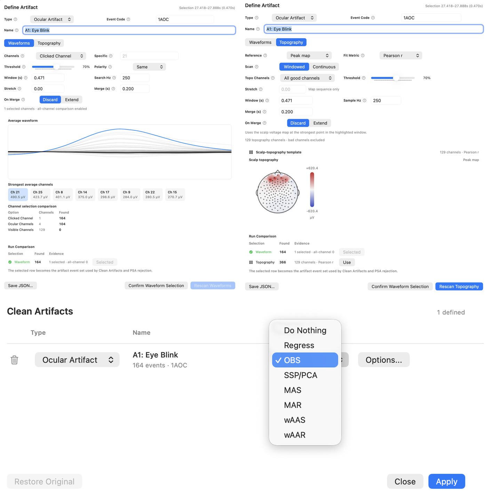

# Artifact Review And Cleaning

EVA supports artifact definition, detection, preview, and cleaning. The workflow starts from the data: identify an artifact, define what it looks like, then decide how EVA should search for and clean similar patterns.

## Define Artifacts

You can define artifacts from waveform regions or scalp topography. Use this when you know the artifact pattern you want to find, such as eye blinks, movement bursts, scanner artifacts, or repeated physiological noise.

When defining an artifact, consider:

- Which channels express the artifact most clearly
- Whether the artifact is time-locked or variable
- Whether waveform shape, topography, or both should guide matching
- Whether similar-looking neural activity could be mistaken for artifact

## Preview Cleaning

EVA includes several cleaning approaches, including regression, OBS, SSP/PCA, and averaging-based methods. Preview the result before applying a cleaning step.

Check whether:

- The artifact is reduced.
- Neighboring neural signal remains plausible.
- New edge artifacts or ringing have not been introduced.
- The method behaves consistently across events or channels.

## MRI Gradient Artifact Correction

For simultaneous EEG/fMRI workflows, EVA includes MRI gradient artifact correction tools. Treat scanner-artifact correction as a high-stakes processing step and validate parameters against known acquisition timing whenever possible.

EVA's fMRI gradient-removal methods are independent re-implementations written from the published papers and EVA's own clean-room functional specifications. They are not copied from, or intended to be bit-identical to, FMRIB FASTR, FACET, BERGEN, AMRI, or other MATLAB toolbox implementations. The same method names describe the scientific family and user-facing intent, but details such as edge handling, donor fallback, numerical tolerances, interpolation, OBS safeguards, and GPU/CPU execution can differ from historical toolbox versions.

### Template Methods: AAS, MAS, And MAR

These methods build a local scanner-artifact template from neighboring TRs or artifact epochs, then subtract that template from the target epoch.

| Method | Template | Scaling | Best fit | Main trade-off |
| --- | --- | --- | --- | --- |
| AAS | Arithmetic mean of neighboring epochs | No fitted scale in EVA's retired Fast AAS path; Allen AAS uses a more guarded running-template variant | Low-motion, stable scanner artifact | Fast and simple, but a contaminated donor can pull the mean and unscaled subtraction cannot track amplitude drift well |
| MAS | Sample-wise median of neighboring epochs | Unscaled | Local-template replacement when the artifact is mostly stable but occasional donor epochs are bad | More robust than AAS to one bad donor, but still assumes the template amplitude is close enough to subtract directly |
| MAR | Sample-wise median of neighboring epochs | Least-squares amplitude fit before subtraction | Artifact amplitude changes across the run | Tracks amplitude better than MAS, but fitted scaling can remove signal that happens to correlate with the template |

Fast AAS is retired from new selections in EVA, but old processing files that name it still reproduce. For new work, MAS is the closest practical replacement when you want the same local-neighbor template idea with better resistance to contaminated donors. Allen AAS remains available as the closer Allen-style average-template method, using fixed sections, correlation-gated template updates, and optional ANC.

### FASTR Family: FASTR, Moosmann, And FARM

FASTR-family methods use EVA's shared slice-template correction engine. They can operate at volume level or slice level, align artifact epochs, fit template scale, subtract the estimated scanner artifact, and optionally run OBS residual removal and ANC. The family differences are mainly how donor epochs are chosen.

| Method | Donor rule | Use when | Notes |
| --- | --- | --- | --- |
| FASTR Original | Temporal neighbors | Scanner artifact is stable enough that nearby epochs are good donors | This is the baseline slice-template method with optional sub-sample alignment, OBS, and ANC |
| Moosmann | Motion-informed neighbors | Head motion changes the artifact, and a motion file is available | High-motion volumes are still corrected but are avoided as donors; EVA tries not to average across a motion event when possible |
| FARM | Correlation-ranked donors | Artifact waveform similarity matters more than proximity in time | EVA searches candidate epochs and prefers donors whose artifact waveform correlates strongly with the target; if too few qualify, it falls back to temporal neighbors |

Shared FASTR-family controls include slices per volume, trigger position, donor-window size, alignment and sub-sample alignment, template scaling, OBS mode, ANC, and optional high-motion donor exclusion. OBS and ANC can improve residual suppression, but they can also remove plausible EEG when the residual or adaptive reference is not artifact-dominated. Preview the correction and inspect representative channels before applying it broadly.

### Motion And Timing Checks

All fMRI gradient-removal methods assume regularly spaced scanner markers and a known relationship between TR markers, slice timing, and EEG samples. Before applying correction:

- Confirm the selected TR marker is the scanner marker, not a task event.
- Check that skipped first/last markers match any dummy scans or trimmed motion rows.
- Use the correct slices-per-volume value for slice-level correction.
- Load motion parameters before using Moosmann or high-motion donor exclusion.
- Record method settings in your analysis notes, especially donor windows, motion threshold, OBS, ANC, and template scaling.

### References

Allen, P. J., Josephs, O., & Turner, R. (2000). A method for removing imaging artifact from continuous EEG recorded during functional MRI. *NeuroImage, 12*(2), 230-239. https://doi.org/10.1006/nimg.2000.0599

Glaser, J., Beisteiner, R., Bauer, H., & Fischmeister, F. P. S. (2013). FACET: A flexible artifact correction and evaluation toolbox for concurrently recorded EEG/fMRI data. *BMC Neuroscience, 14*, 138.

Liu, Z., de Zwart, J. A., van Gelderen, P., Kuo, L.-W., & Duyn, J. H. (2012). Statistical feature extraction for artifact removal from concurrent fMRI-EEG recordings. *NeuroImage, 59*(3), 2073-2087. https://doi.org/10.1016/j.neuroimage.2011.10.042

Moosmann, M., Schoenfelder, V. H., Specht, K., Scheeringa, R., Nordby, H., & Hugdahl, K. (2009). Realignment parameter-informed artefact correction for simultaneous EEG-fMRI recordings. *NeuroImage, 45*(4), 1144-1150. https://doi.org/10.1016/j.neuroimage.2009.01.024

Niazy, R. K., Beckmann, C. F., Iannetti, G. D., Brady, J. M., & Smith, S. M. (2005). Removal of FMRI environment artifacts from EEG data using optimal basis sets. *NeuroImage, 28*(3), 720-737. https://doi.org/10.1016/j.neuroimage.2005.06.067

van der Meer, J. N., Tijssen, M. A. J., Bour, L. J., van Rootselaar, A. F., & Nederveen, A. J. (2010). Robust EMG-fMRI artifact reduction for motion (FARM). *Clinical Neurophysiology, 121*(5), 766-776.
