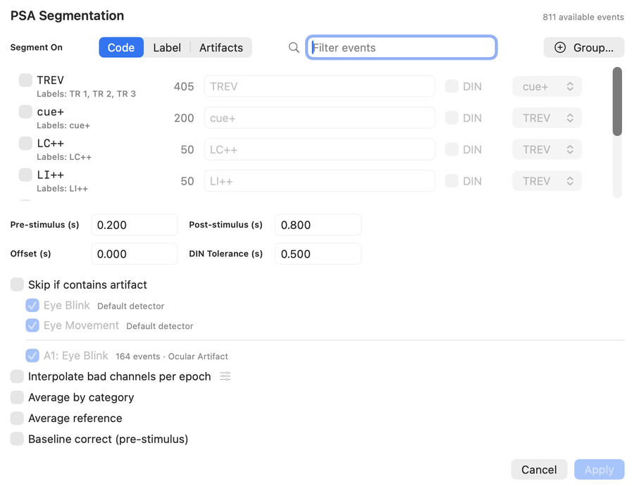
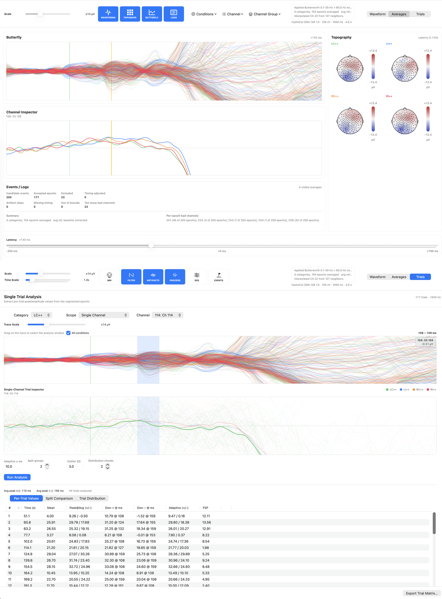

# Epochs And Averages

EVA can segment recordings around events, compute category averages, and support single-trial analysis.

## Create Epochs

When creating epochs, choose:

- Event categories
- Time window around each event
- Baseline interval
- Whether to apply average reference
- Inclusion or exclusion rules for bad channels and artifacts

## Inspect Averages

After averaging, inspect the result as:

- Channel waveforms
- Butterfly plots
- Topographic maps
- Category overlays

## Single-Trial Analysis

Single-trial tools can extract peak and amplitude values from selected channels and windows. Use these exports for downstream statistics when trial-level variability matters.

Before exporting, confirm:

- The measurement window matches the component of interest.
- Baseline choices are consistent.
- Rejected or cleaned trials are handled consistently.
