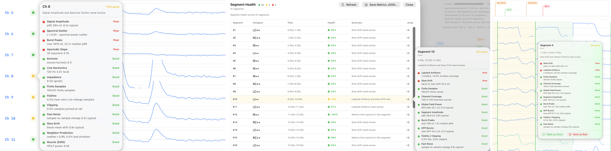

# Health Scoring

EVA includes explainable channel and segment health scoring. Scores are intended to focus review, not to replace human judgment.

## Channel Health

Channel health can consider metrics such as amplitude, spectral outliers, impedance, line harmonics, and drift. Use the detail view to understand why a channel was rated good, watch, or poor.

## Segment Health

Segment health applies the same transparent idea to time intervals. A segment score can help identify bursts, drift, artifact overlap, or other local problems.

## How To Use Scores

- Treat scores as triage.
- Inspect the metrics behind the score.
- Compare automated ratings with your lab's review standards.
- Export reviewed metrics when building future training datasets.

## Training Data Exports

EVA can export JSON snapshots for channel and segment health metrics. These files are intended to support future model training while preserving the explainable metrics used by the current deterministic system.
