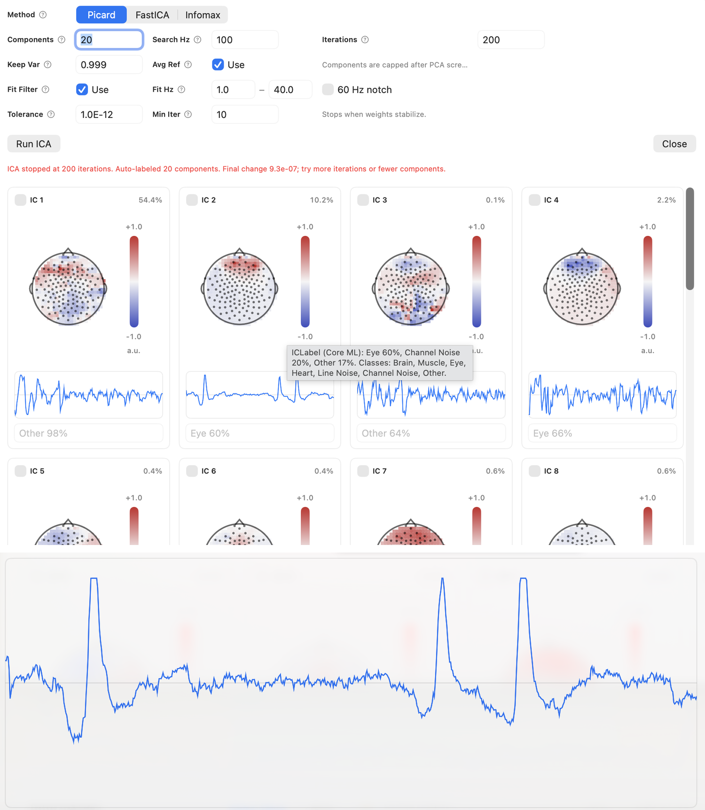

# ICA

EVA includes ICA-based component review and can use a bundled Core ML ICLabel model for component classification.

## Review Components

Component labels are helpful, but they should not replace inspection. EVA shows component time courses so you can compare a proposed label with the actual signal pattern.

For each component, review:

- Label and confidence
- Time course
- Scalp distribution
- Relationship to known artifacts or events
- Effect of removing the component

## ICLabel

ICLabel provides per-component classification probabilities. Use these probabilities as evidence, not as a command. Low-confidence labels or labels near a decision boundary deserve manual review.

## Export Or Remove

Depending on the workflow, a component may be removed, retained, or exported as a synthetic physiological channel for further inspection.

!!! note "Verify in app"
    Confirm the current names of ICA export and component-removal controls.
