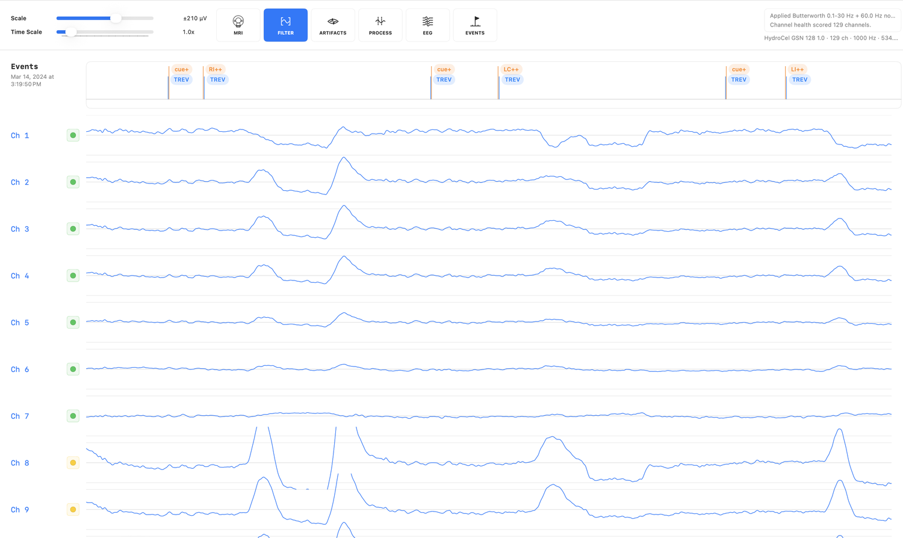
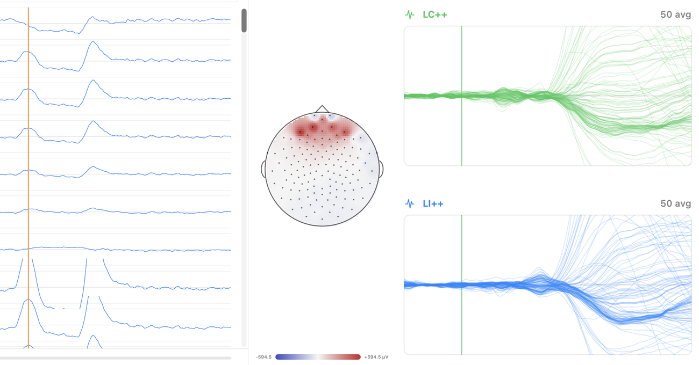

# Viewing Recordings

The waveform view is the center of EVA. Channels are shown as traces, events appear in temporal context, and processing controls remain close to the data.

## Waveform Review

Use the waveform to inspect:

- Raw signal shape and amplitude
- Large movement or electrode artifacts
- Line noise or slow drift
- Event timing
- Channel-specific problems
- Effects of filtering or artifact correction

## Events And Markers

EVA supports event browsing and user markers. Use events to orient task timing and use markers to identify intervals or moments that need later review.

### Where An Event Marker Sits

Every event carries a *time anchor* saying which instant its marker names:

| Anchor | The marker is | Typical source |
| --- | --- | --- |
| Onset | the start of the event; its span runs forward from the flag | every imported file format, single-map Topography and Continuous scans |
| Centered | the middle of the event; its span straddles the flag | waveform-template and Trajectory matching |
| Peak | a measured extremum, with the event's width recorded around it | ECG (R wave), BCG, eye-artifact threshold detection |

Click an event's flag to see its span highlighted on the traces, and hover or tap it for a popover that names the instant by its anchor ("Onset", "Center" or "Peak") along with the interval the event covers.

Imported markers are read as onsets, because that is what file formats record. If your markers instead sit at the middle or the peak of what they describe, add a rule under **Settings ▸ Events** naming the event code and the anchor it should use. A rule can also supply a duration to assume for markers that carry none — without one there is no span to highlight or clean over, since an instantaneous event's onset, center and peak are the same instant.

Rules are applied when a recording is opened. After editing them, use **Reapply to Open Recordings** in the same tab to re-read a file that is already open. EVA's own detectors measure where their events sit and are unaffected by these rules.

## Topographic Views

Topographic maps can help determine whether a burst or component has a plausible scalp distribution. A spatially coherent neural pattern and a focal channel artifact often look different even when the waveform amplitude is similar.

!!! note "Verify in app"
    Confirm the exact gesture or command for opening a scalp map from a waveform sample.
