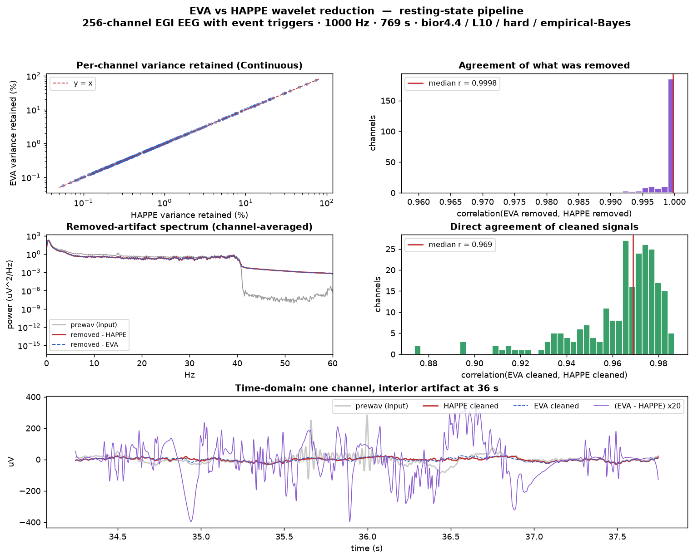
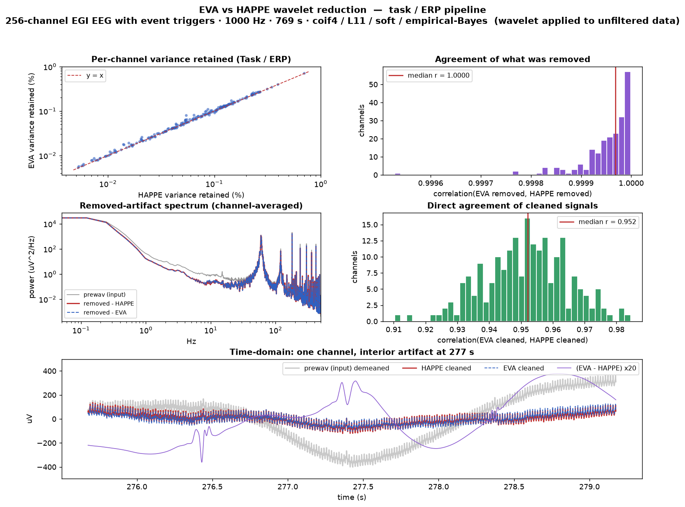

# HAPPE wavelet-reduction parity — measured on real data

Status: **validated**, 2026-09-12. Companion to
[`empirical-bayes-port.md`](empirical-bayes-port.md) (the threshold model this
result exercises) and a sibling of [`method-comparison.md`](method-comparison.md)
in kind: a measured-results record, not implementation guidance.

This document records a direct, empirical check that EVA's Wavelet Artifact
Reducer (`EVA/Wavelet/WaveletReducer.swift`) reproduces the wavelet-thresholding
step of HAPPE — across every wavelet configuration HAPPE selects for its
different pipelines — on a real high-density EEG recording. It is evidence, not
a specification; the specification of what EVA implements and why is
[`empirical-bayes-port.md`](empirical-bayes-port.md) and the header of
`WaveletReducer.swift`.

## What "parity" means here, and how it was tested

The comparison is **purely empirical and uses HAPPE's own outputs** — no HAPPE
source was read (the clean-room hook blocks `resources/HAPPE/*.m`, and it was not
needed). HAPPE writes two files around its wavelet step:

- `*_prewav.set` — the exact signal handed **into** the wavelet step, and
- `*_wavclean.set` — HAPPE's wavelet-cleaned output.

So the test is: take HAPPE's own `prewav` as input, run **EVA's actual reducer
code** on it, and compare the result to HAPPE's `wavclean`. EVA's engine is not
re-implemented for the test — `WaveletReducer.swift` and
`EmpiricalBayesThreshold.swift` were compiled verbatim into a small standalone
executable that calls `WaveletReducer.reduceChannel(...)` per channel with the
mode's default configuration (CPU path; GPU disabled). The only code removed to
compile it standalone was the app-coupled orchestration (`reduce`, the GPU
batch path, `findCandidates`) — none of the per-channel math.

Four quantities are reported per channel, over the whole continuous recording:

| metric | definition | what it shows |
| --- | --- | --- |
| **removed-artifact correlation** | corr(`prewav − EVA`, `prewav − HAPPE`) | whether the two tools remove *the same thing* |
| cleaned-signal correlation | corr(`EVA cleaned`, `HAPPE cleaned`) | agreement on what survives |
| variance retained | var(cleaned) / var(prewav) | how aggressive each is |
| residual | RMS(`EVA − HAPPE`) as % of signal RMS | absolute disagreement |

The removed-artifact correlation is the primary number: the cleaned residual is
tiny (see below), so it is the more sensitive and more honest measure of whether
the two engines are doing the same operation.

## The recording and the three pipelines

A single high-density **256-channel EGI EEG recording with event triggers**
(1000 Hz, ~13 min continuous, two acquisition runs) was processed through
**HAPPE 4.1.0** three ways. The recording was left **unsegmented** in every case
so the wavelet stage — which HAPPE runs on continuous data, before
segmentation — could be compared directly.

HAPPE selects the wavelet family, decomposition depth, and threshold rule from
the pipeline flags, not from a user wavelet setting. The three runs exercise both
of its configurations, and EVA has a matching mode for each:

| HAPPE pipeline (`paradigm`) | band-pass | input to wavelet | HAPPE wavelet | EVA mode |
| --- | --- | --- | --- | --- |
| resting-state (`task=0, ERP.on=0`) | 1–40 Hz | **filtered** | bior4.4 / L10 / **hard** | Continuous EEG |
| task, non-ERP (`task=1, ERP.on=0`) | 1–100 Hz | **filtered** | bior4.4 / L10 / **hard** | Continuous EEG |
| task, ERP (`task=1, ERP.on=1`) | 0.1–40 Hz | **unfiltered** | coif4 / L11 / **soft** | Task / ERP |

Two behaviors of HAPPE fall out of this table and are worth stating plainly,
because they surprised us and will surprise others:

1. **The wavelet family is gated on the ERP flag, not on "task" and not on
   segmentation.** Selecting the task pipeline (`task=1`) with ERP analysis off
   uses the *same* wavelet as resting (bior4.4 / hard). Only `ERP.on=1` switches
   to coif4 / soft. Turning segmentation on is not required and does not by
   itself change the wavelet (segmentation runs after the wavelet step).
2. **The ERP path wavelet-cleans the *unfiltered, broadband* signal.** The
   band-pass is applied afterward, as a separate stage. So in the ERP run the
   wavelet step sees the full sub-1 Hz drift and the high-frequency content,
   and — like HAPPE — removes almost all of it.

EVA's `WaveletReductionMode` defaults line up with the table: Continuous EEG is
bior4.4 / hard with `levelCount = 10` at 1000 Hz; Task / ERP is coif4 / soft with
`levelCount = 11`; both default the threshold model to empirical Bayes, matching
`wdenoise`'s documented `'Bayes'` option (see
[`empirical-bayes-port.md`](empirical-bayes-port.md)).

## Results

Medians across channels, both runs, per pipeline:

### Resting-state pipeline — bior4.4 / L10 / hard (filtered input)

| run | channels | removed-artifact corr | cleaned corr | variance retained (HAPPE / EVA) | residual |
| --- | --- | --- | --- | --- | --- |
| 1 | 236 | 0.9998 | 0.969 | 0.661% / 0.657% | 2.1% |
| 2 | 242 | 1.0000 | 0.978 | 0.540% / 0.541% | 1.6% |

Removed power matched HAPPE band-by-band (EVA ÷ HAPPE = 1.00 from drift through
low-gamma).

### Task, non-ERP pipeline — bior4.4 / L10 / hard (filtered input)

Same wavelet configuration as resting (this is finding #1 above), on a 1–100 Hz
input. Ground-truth outputs for this run were later overwritten, so only the
measured medians are retained:

| run | channels | removed-artifact corr | cleaned corr | variance retained (HAPPE / EVA) | residual |
| --- | --- | --- | --- | --- | --- |
| 1 | 230 | 0.9997 | 0.956 | 0.773% / 0.773% | 2.5% |
| 2 | 234 | 0.9996 | 0.960 | 0.931% / 0.931% | 2.7% |

Confirmed empirically by running *both* EVA modes against this output: the
Continuous config matched (removed-corr 0.9997) while the Task/ERP config did
not (0.9982), which is how we established that `ERP.on`, not `task`, drives the
wavelet choice.

### Task, ERP pipeline — coif4 / L11 / soft (unfiltered input)

| run | channels | removed-artifact corr | cleaned corr | variance retained (HAPPE / EVA) | residual |
| --- | --- | --- | --- | --- | --- |
| 1 | 206 | 1.0000 | 0.952 | 0.063% / 0.065% | 0.06% |
| 2 | 200 | 1.0000 | 0.947 | 0.042% / 0.042% | 0.05% |

The removed-artifact spectra overlap across the entire 0.1–500 Hz band — the huge
sub-1 Hz drift, the residual line-noise peak and its harmonics, all removed
identically.

## Reading the numbers honestly

- **The residual EEG is small, on purpose.** HAPPE's paradigm subtracts the
  *denoised* wavelet reconstruction as its artifact estimate, so the "cleaned"
  signal is the sparse high-frequency residual that survives — a median of well
  under 1% of the input variance in every pipeline, and ~0.05% in the ERP path
  where the broadband input is drift-dominated. Both tools are equally
  aggressive; the point of this document is that they agree, not that the
  operation is gentle. A cleaned-signal correlation of ~0.95–0.98 is a strong
  result *because* it is measured on that tiny residual.
- **What the ~2% residual is, and is not.** It is not a configuration mismatch.
  It was unchanged with EVA's linear detrend on vs. off (the data is already
  high-passed, or the coif4 approximation band absorbs the drift the same way),
  and it does not track any single band. It is the expected floor of two
  independent implementations: EVA's from-the-paper empirical-Bayes threshold
  estimate, its reflect-padded boundaries, and Float rounding on the CPU path.
- **Scope.** This validates the wavelet-thresholding stage in isolation, on one
  (high-quality, high-density) recording. It says nothing about the rest of
  either pipeline (line-noise removal, bad-channel handling, ICA/muscIL,
  re-referencing, segmentation), and it is not a claim that wavelet thresholding
  is the right amount of cleaning — only that EVA and HAPPE do the same wavelet
  thresholding.

## Reproducing this

The harness is deliberately throwaway (it lives outside the repo). To redo it:

1. Run HAPPE with the desired pipeline flags, unsegmented, keeping the
   intermediate `*_prewav.set` / `*_wavclean.set` files.
2. Export `prewav.data` to a raw channel-major `float32` blob.
3. Compile `EVA/Wavelet/WaveletReducer.swift` + `EVA/Wavelet/EmpiricalBayesThreshold.swift`
   into a standalone executable (stub the app symbols the file references —
   `MFFSignalData`, `WaveletMetalBackend.isAvailable`, `Downsampler`,
   `evaMaxWorkers` — and delete `reduce`/`reduceOnGPU`/`findCandidates`; the
   per-channel `reduceChannel` and its transform/threshold math are what runs).
4. Call `WaveletReducer.reduceChannel` per channel with
   `WaveletReductionMode.<continuousEEG|erp>.defaultConfiguration(samplingRate:)`.
5. Compare the cleaned output to HAPPE's `wavclean.data` with the four metrics
   above.

The wavelet configuration is taken from the mode default, which is the whole
point — no per-run tuning was applied to reach these numbers.
